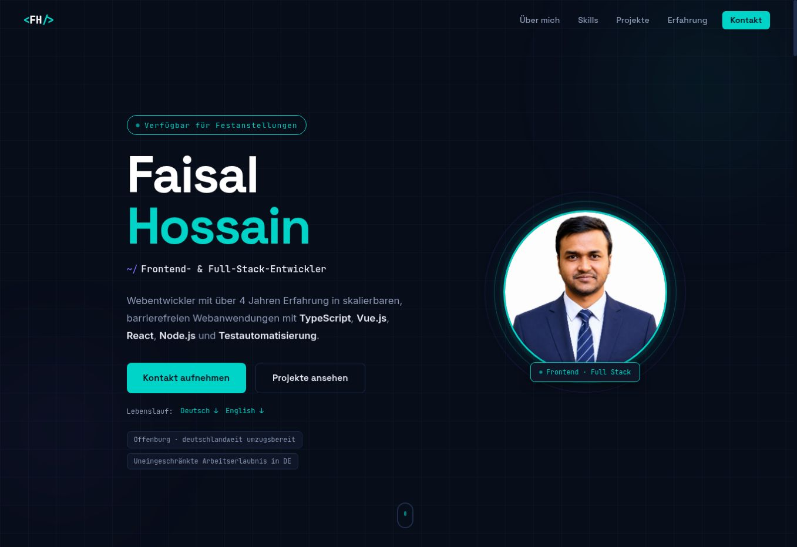

<div align="center">

# Faisal Hossain · Developer Portfolio

**Frontend & Full-Stack Developer** focused on accessible, maintainable web applications with TypeScript, Vue.js, React, and Node.js.

[View the live portfolio](https://fhjoy.github.io/portfolio/) · [LinkedIn](https://www.linkedin.com/in/md-faisal-hossain-germany/) · [GitHub profile](https://github.com/fhjoy)

</div>



## Purpose

This repository contains my professional portfolio for the German job market. It brings together my frontend and full-stack experience, selected projects, measurable results, work-reference summaries, education, and contact options in one responsive website.

The portfolio is written in German and includes downloadable CVs in German and English.

## Professional profile at a glance

| Evidence | Result |
| --- | ---: |
| Professional web development | 4+ years |
| Deutsche Telekom projects | 20+ |
| Partner websites | 17+ |
| Reusable UI components | 30+ |
| Accessibility findings resolved | 300+ |
| Natif.ai E2E test coverage | approximately 10% → 85% |
| Natif.ai component test coverage | approximately 0% → 70% |

My main areas of work are component-based frontend architecture, accessibility according to WCAG, REST and GraphQL integration, test automation, legacy modernization, and collaboration in Scrum and Kanban teams.

## What visitors can explore

The website follows a clear professional journey:

1. **Introduction** — role, availability, location, work authorization, and CV downloads
2. **About** — development focus and professional positioning
3. **Technologies** — frontend, backend, testing, DevOps, and supporting tools
4. **Selected work** — professional, academic, and personal projects
5. **Experience** — roles, responsibilities, technologies, and measurable outcomes
6. **References** — concise summaries of employment and academic recommendations
7. **Education** — master's degree, bachelor's degree, certificates, awards, and languages
8. **Contact** — direct links for recruiters and engineering teams

## Selected work represented

### Enterprise frontend development

Work for Deutsche Telekom and partner platforms, including reusable Vue and React components, accessibility improvements, API work, migrations, and legacy-code modernization. Customer source code and project details remain confidential.

### AI-powered document processing

Frontend development and test automation for an intelligent document-processing product at Natif.ai, including Vue components, Jest and Cypress tests, CI/CD support, and temporary coordination of testing activities.

### Master's thesis: SPA, SSR, and SSG

A controlled practical comparison of three web-rendering strategies using React, Next.js, Node.js, Express, MongoDB, and Material UI.

- [Single-Page Application](https://github.com/fhjoy/spa)
- [Server-Side Rendering](https://github.com/fhjoy/ssr)
- [Static Site Generation](https://github.com/fhjoy/ssg)

### Personal full-stack projects

- [Tour World](https://github.com/fhjoy/tour-world) — server-rendered tourism and booking platform built with Node.js, Express, MongoDB, Mongoose, Pug, JWT, Stripe, and Mapbox
- [Recipe App](https://github.com/fhjoy/Recipe--App) — modular JavaScript single-page application with recipe search, API integration, pagination, serving adjustment, bookmarks, and custom recipes

## Frontend engineering decisions

This portfolio deliberately uses a small, framework-free codebase. The goal is to keep the site fast, understandable, and easy to deploy while still demonstrating attention to production-quality details.

### Accessibility

- Semantic sections and heading structure
- Skip link for keyboard users
- Visible `:focus-visible` states
- Accessible mobile-navigation button with `aria-expanded` and `aria-controls`
- Escape-key and outside-click handling for the mobile menu
- Reduced-motion support through `prefers-reduced-motion`
- Descriptive image alternatives and labels for interactive elements
- Text-based language levels instead of ambiguous progress bars

### Responsive interaction

- Mobile navigation with synchronized accessibility state
- Active navigation state based on the current section
- Intersection Observer reveal effects
- Subtle pointer-based hero movement on compatible devices
- Smooth scrolling with reduced-motion fallback
- Responsive grids for projects, experience, references, education, and contact details

### Discoverability

- Descriptive page title and meta description
- Canonical URL
- Open Graph and Twitter metadata
- JSON-LD `Person` structured data
- Search-engine indexing directives
- Explicit image dimensions and prioritized hero-image loading

## Technology

| Area | Implementation |
| --- | --- |
| Structure | Semantic HTML5 |
| Styling | Modern CSS, custom properties, responsive grids |
| Interaction | Vanilla JavaScript, Intersection Observer, Media Queries API |
| Typography | Space Grotesk, Inter, JetBrains Mono |
| Hosting | GitHub Pages |
| Documents | German and English CVs in PDF format |

There is no framework, package manager, bundler, or runtime dependency required to view the site.

## Repository structure

```text
portfolio/
├── documents/
│   ├── Faisal_Hossain_CV_EN.pdf
│   └── Lebenslauf_Faisal_Hossain_DE.pdf
├── images/
│   └── faisal_hossain.png
├── index.html
├── script.js
└── style.css
```

## Run locally

Clone the repository:

```bash
git clone https://github.com/fhjoy/portfolio.git
cd portfolio
```

Start any static file server, for example:

```bash
python -m http.server 8000
```

Open `http://localhost:8000`.

Opening `index.html` directly also works for most of the site, but a local server is recommended for testing document links and browser behavior consistently.

## Deployment

The production site is hosted with GitHub Pages:

**[fhjoy.github.io/portfolio](https://fhjoy.github.io/portfolio/)**

Because this is a static website, deployment requires no server configuration or environment variables. Changes published to the configured GitHub Pages branch become part of the live portfolio.

## References and confidentiality

The portfolio summarizes verified employment and academic references from exagon consulting & solutions GmbH, Natif.ai, and Hochschule Offenburg. Complete documents are shared during the application process rather than published publicly.

Some commercial project details and source code are intentionally omitted because they are customer-confidential.

## Current status

I am based in Offenburg and currently open to full-time frontend or full-stack positions. I have unrestricted work authorization in Germany and am willing to relocate within Germany for the right opportunity.

## Contact

- [Live portfolio](https://fhjoy.github.io/portfolio/)
- [LinkedIn](https://www.linkedin.com/in/md-faisal-hossain-germany/)
- [GitHub](https://github.com/fhjoy)

## License

No open-source license is currently specified. The source is publicly visible for portfolio review; reuse requires permission from the author.
