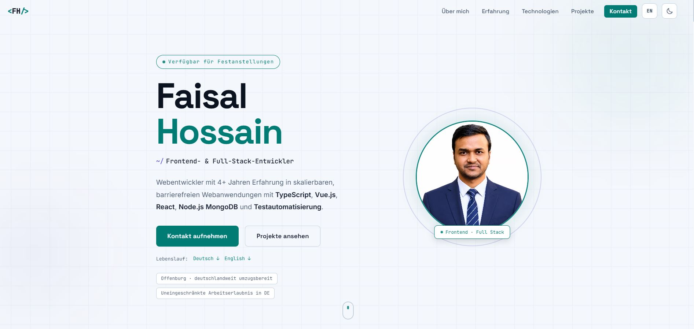
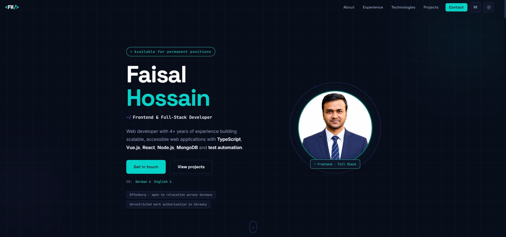

<div align="center">

# Faisal Hossain · Developer Portfolio

**Frontend & Full-Stack Developer** focused on accessible, maintainable web applications with TypeScript, Vue.js, React, Node.js, and MongoDB.

[View the live portfolio](https://fhjoy.github.io/portfolio/) · [LinkedIn](https://www.linkedin.com/in/md-faisal-hossain-germany/) · [GitHub profile](https://github.com/fhjoy)

</div>




## Purpose

This repository contains my professional portfolio for the German job market. It brings together my frontend and full-stack experience, selected projects, measurable results, work-reference summaries, education, and contact options in one responsive website.

The portfolio provides carefully written German and English experiences and includes downloadable CVs in both languages. It detects the visitor's browser language on the first visit, offers a persistent manual language choice, and publishes independently measured Lighthouse results from GitHub Actions.

## Professional profile at a glance

| Evidence                              |                  Result |
| ------------------------------------- | ----------------------: |
| Professional web development          |                4+ years |
| Deutsche Telekom projects             |                     20+ |
| Partner websites                      |                     17+ |
| Reusable UI components                |                     30+ |
| Accessibility findings resolved       |                    300+ |
| Natif.ai reusable frontend components |                     20+ |
| Natif.ai E2E test coverage            | approximately 10% → 85% |
| Natif.ai component test coverage      |  approximately 0% → 70% |

My main areas of work are component-based frontend architecture, accessibility according to WCAG, REST and GraphQL API development and integration, test automation, legacy modernization, and collaboration in Scrum and Kanban teams.

## What visitors can explore

The website follows a clear professional journey:

1. **Introduction** — role, availability, location, work authorization, and CV downloads
2. **About** — development focus and professional positioning
3. **Experience** — roles, responsibilities, technologies, and measurable outcomes
4. **References** — concise summaries of employment and academic recommendations
5. **Technologies** — frontend, backend, testing, DevOps, and supporting tools
6. **Selected work** — current, academic, and personal projects with concise engineering insights
7. **Education** — master's degree, bachelor's degree, certificates, and awards
8. **Languages** — language skills with clear proficiency levels
9. **Quality evidence** — current CI-generated Lighthouse results for both language versions
10. **Contact** — direct links for recruiters and engineering teams

## Selected work represented

### Enterprise frontend development

Work for Deutsche Telekom and partner platforms, including reusable Vue and React components, accessibility improvements, API work, migrations, and legacy-code modernization. Customer source code and project details remain confidential.

### AI-powered document processing

Frontend development and test automation for an intelligent document-processing product at Natif.ai, including Vue components, Jest and Cypress tests, CI/CD support, and temporary coordination of testing activities.

### Master's thesis: SPA, SSR, and SSG

A controlled comparison of three similarly scoped e-commerce applications using React, Next.js, Node.js, Express, MongoDB, and Material UI. A dedicated comparison dialog provides a concise decision reference, while the separate engineering insight explains the experimental method, trade-offs, and conclusions.

### Personal full-stack projects

- roleNaviq · in development — A full-stack job-application platform built with TypeScript throughout. The current implementation combines a React and Vite frontend with a Node.js, Express, MongoDB, and Mongoose backend. Authentication uses JWTs in HttpOnly cookies, while protected API operations also enforce resource ownership on the server.

The portfolio presents roleNaviq honestly as an active project. Its engineering panel focuses on state boundaries, security decisions, data-model trade-offs, and the testing work planned before a public demo.

- Tour World — server-rendered tourism and booking platform built with Node.js, Express, MongoDB, Mongoose, Pug, JWT, Stripe, and Mapbox
- Recipe App — modular JavaScript single-page application with recipe search, API integration, pagination, serving adjustment, bookmarks, and custom recipes

## Frontend engineering decisions

This portfolio deliberately uses a small, framework-free codebase. The goal is to keep the site fast, understandable, and easy to deploy while still demonstrating attention to production-quality details.

### Accessibility

- Semantic sections and heading structure
- Skip link for keyboard users
- Visible `:focus-visible` states
- Accessible mobile-navigation button with `aria-expanded` and `aria-controls`
- Escape-key and outside-click handling for the mobile menu
- Native, keyboard-accessible project case-study dialogs with focus restoration
- An accessible, horizontally scrollable SPA/SSR/SSG comparison table with semantic row and column headers
- Reduced-motion support through `prefers-reduced-motion`
- Descriptive image alternatives and labels for interactive elements
- Text-based language levels instead of ambiguous progress bars

### Responsive interaction

- Mobile navigation with synchronized accessibility state
- Light and dark themes with system preference detection and a remembered manual selection
- Active navigation state based on the current section
- Responsive engineering panels for architecture decisions, trade-offs, and lessons learned
- Intersection Observer reveal effects
- Subtle pointer-based hero movement on compatible devices
- Smooth scrolling with reduced-motion fallback
- Responsive grids for projects, experience, references, education, and contact details

### German and English experiences

- German content at `/` and professionally written English content at `/en/`
- First-visit selection from the browser's preferred language: German for `de`, English for all other languages
- A visible `DE`/`EN` switch that remembers the visitor's explicit choice in local storage
- Localised navigation, interaction labels, dates, metadata, structured data, privacy information, and project case studies
- `hreflang`, canonical URLs, and localised Open Graph metadata for search engines and link previews

### Automated quality dashboard

The quality dashboard has its own numbered section after Languages and is backed by Lighthouse CI rather than manually entered numbers. On every relevant push to `master`, GitHub Actions:

1. audits the German and English pages three times each;
2. calculates the median for performance, accessibility, best practices, and SEO per page;
3. publishes the lower of the two page medians, so one strong language version cannot hide a weaker one;
4. stores the full Lighthouse reports as a workflow artifact for 30 days; and
5. fails the quality gate when a published score falls below its threshold.

The thresholds are currently 80 for performance, 95 for accessibility, and 90 for both best practices and SEO. Before the first workflow run, the dashboard intentionally shows **Audit pending** instead of invented scores.

### Discoverability

- Descriptive page title and meta description
- Canonical URL
- Open Graph and Twitter metadata
- JSON-LD `Person` structured data
- Search-engine indexing directives
- Explicit image dimensions and prioritized hero-image loading

## Technology

| Area        | Implementation                                                                |
| ----------- | ----------------------------------------------------------------------------- |
| Structure   | Semantic HTML5                                                                |
| Styling     | Modern CSS, custom properties, responsive grids                               |
| Interaction | Vanilla JavaScript, Intersection Observer, Media Queries API, Web Storage API |
| Typography  | Space Grotesk, Inter, JetBrains Mono                                          |
| Hosting     | GitHub Pages                                                                  |
| Documents   | German and English CVs in PDF format                                          |
| Quality     | Lighthouse CI and GitHub Actions                                              |

There is no framework, package manager, bundler, or runtime dependency required to view the site.

## Repository structure

```text
portfolio/
├── .github/
│   └── workflows/
│       └── portfolio-quality.yml
├── docs/
│   ├── documents/
│   │   ├── Faisal_Hossain_CV_EN.pdf
│   │   └── Lebenslauf_Faisal_Hossain_DE.pdf
│   └── images/
│       └── faisal_hossain.avif
├── en/
│   └── index.html
├── quality/
│   └── latest.json
├── scripts/
│   ├── check-quality-thresholds.mjs
│   └── create-quality-summary.mjs
├── .gitignore
├── index.html
├── lighthouserc.json
├── script.js
└── style.css
```

## Run locally

Clone the repository:

```bash
git clone https://github.com/fhjoy/portfolio.git
cd portfolio
```

Run a local server from the repository root so redirects, the English route, and the quality JSON use normal HTTP behaviour:

```bash
python -m http.server 8000
```

Then open `http://localhost:8000/`. Opening `index.html` directly still displays the portfolio, but the automated quality summary remains pending because browsers restrict local-file fetches.

## Deployment

The production site is hosted with GitHub Pages:

**[fhjoy.github.io/portfolio](https://fhjoy.github.io/portfolio/)**

Because this is a static website, deployment requires no server configuration or environment variables. Preserve the repository structure when publishing so `/en/`, `/quality/`, the scripts, and the workflow remain available.

A push to `master` starts the **Portfolio quality** workflow. It commits the generated `quality/latest.json` back to the repository with `[skip ci]`, which prevents a workflow loop. If repository policy blocks that commit, enable **Read and write permissions** under **Settings → Actions → General → Workflow permissions**, then run the workflow again from the Actions tab.

## References and confidentiality

The portfolio summarizes verified employment and academic references from exagon consulting & solutions GmbH, Natif.ai, Anik Telecom Ltd., Venus IT Institute, and Hochschule Offenburg. Complete documents are shared during the application process rather than published publicly.

Some commercial project details and source code are intentionally omitted because they are customer-confidential.

## Current status

I am based in Offenburg and currently open to full-time frontend or full-stack positions. I have unrestricted work authorization in Germany and am willing to relocate within Germany for the right opportunity.

## Contact

- [Live portfolio](https://fhjoy.github.io/portfolio/)
- [LinkedIn](https://www.linkedin.com/in/md-faisal-hossain-germany/)
- [GitHub](https://github.com/fhjoy)

## License

No open-source license is currently specified. The source is publicly visible for portfolio review; reuse requires permission from the author.
